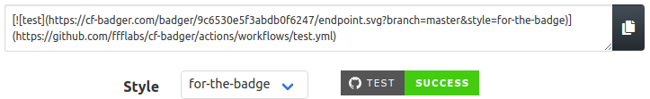

&nbsp; &nbsp;&nbsp; &nbsp;&nbsp; &nbsp;&nbsp; &nbsp;&nbsp; &nbsp;&nbsp; &nbsp;

Cf-Badger generates short urls displaying current status (actually, delayed up to 5 min) of your private repos workflows. 
 

&nbsp; 
&nbsp; 

 

## FAQ

### Why? 

⛨ Albeit it covers most bases, Shields.io's excellent service doesn't cover private repos. 

:octocat: Github provides badges for workflows on these repos, but unless you have read permissions on it, and you're currently logged on GH, only a broken image is displayed. 

<small align="center" style="text-align:center">How to get from broken to flawless?</small>

🌐	 I wanted to enable publicly displayed status badges to use in Github Pages, healthchecks dashboards, repo wikis and, even simpler, to see the real output of my README when previewing it on my IDE.

Also, CF-Badger is my project for the **[Cloudflare Developer Summer Challenge](https://challenge.developers.cloudflare.com/)**
### How?

🎯 We request your workflows run outcome directly to Github's API, on your behalf. Because of this, you'll need to enter a [personal access token](https://github.com/settings/tokens/new?scopes=repo&description=cf-badger.com) with 'repo' privileges for CF-Badger to access said info.

🗃️ We compute and expose the last run outcome as JSON to [Shields.io endpoint API](https://shields.io/endpoint), without which CF-Badger wouldn't work.
### Security Concerns 🔐

Your token won't be part of the generated URL. Instead, we'll store it internally, and provide an url you can safely share without exposing your token.

### Do I need a token for public repos? 🔓

👍 Yes, because we still query Github's API. However, if you intend to display workflow status badges for public repos, you can use Shields.io direcly. Just look in their [Builds Category](https://shields.io/category/build) for "Github Workflows" section.

### Why do you address yourself as "we" if you're the only contributor? 🤷

It kinda makes the project sound like a serious initiative. 

--------------
## Acknowledgements 🏆

**[Cloudflare Workers](https://www.cloudflare.com/products/workers)**, along with [Workers KV](https://www.cloudflare.com/products/workers-kv/), [Cloudflare Pages](https://pages.cloudflare.com/) and [Durable Objects](https://blog.cloudflare.com/introducing-workers-durable-objects/). This is the blazing fast platform on which CF-Badger runs and replicates over 200+ locations worldwide. Did I mention CF-Badger is my project for the **[Cloudflare Developer Summer Challenge](https://challenge.developers.cloudflare.com/)**?

**[Shields.io](https://shields.io)**, whose service renders actual badges and without which CF-Badger would generate broken images, which would be ironic.

**[Atrox's Github Actions Badge](https://actions-badge.atrox.dev/)**, on which CF-Badger was inspired. Albeit I used (and loved) its functionality, I wanted to improve it by:

- Avoid exposing your personal access token in the badge's URL
- Allowing you to pick which action to display, given a repo might have several relevant workflows in place
- Enumerating available workflows and request their status by ID under the hood

