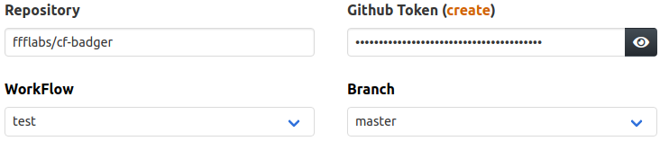

&nbsp; &nbsp;&nbsp; &nbsp;&nbsp; &nbsp;&nbsp; &nbsp;&nbsp; &nbsp;&nbsp; &nbsp;

Cf-Badger generates short urls displaying current status (actually, delayed up to 5 min) of your private repos workflows. 

 &nbsp; &nbsp;  &nbsp; &nbsp; 

### Why? 

Because, unless you're logged in github, it isn't trivial to display current statuses. And it grinds my gears when I see broken images in README's preview.

### How?

We request this info directly to Github's API on your behalf, so you'll need to enter a [personal access token](https://github.com/settings/tokens/new?scopes=repo&description=cf-badger.ctohm.com) with 'repo' privileges. 

### Security Concerns

Your token token won't be part of the generated URL. Instead, we'll store it in a [Workers KV](https://www.cloudflare.com/products/workers-kv/) entry, and provide an url you can safely share without exposing your token.

*Please note that, if you intend to display workflow status badges for public repos, you can use Shields.io direcly. Just look in their [Builds Category](https://shields.io/category/build) for "Github Workflows" section.*

### Acknowledgements

CF-Badger was inspired in [Atrox's Github Actions Badge](https://actions-badge.atrox.dev/), which I used and loved, but wanted to improve by:

- Avoid exposing your personal access token in the badge's URL
- Allowing you to pick which action to display, given a repo might have several relevant workflows in place

