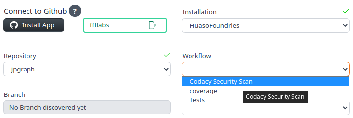
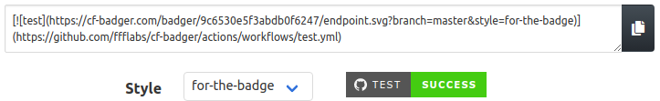
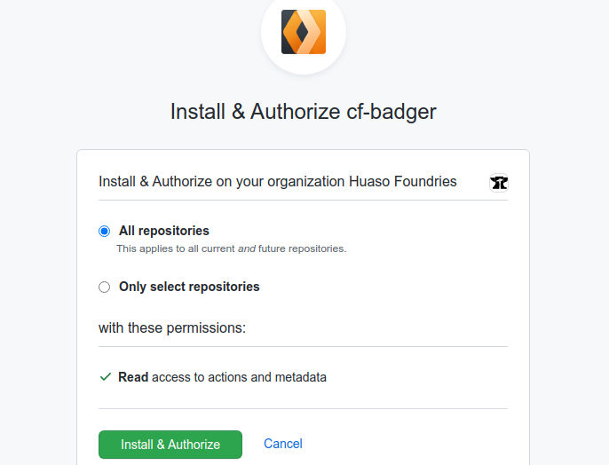

&nbsp; &nbsp;&nbsp; &nbsp;&nbsp; &nbsp; &nbsp; &nbsp;&nbsp; &nbsp;&nbsp; &nbsp;

[Cf-Badger](https://cf-badger.com) generates short urls displaying current status (actually, delayed up to 5 min) of your private repos workflows without exposing but the bare minimum of your code.
 

&nbsp; 
&nbsp; 

<a href="https://cf-badger.com">CF-Badger</a> is my project for the <a href="https://challenge.developers.cloudflare.com/">Cloudflare Developer Summer Challenge</a>

 

 

## 💥 Private Repos vs Public Badges. That's our pain point

Status badges are awesome. What's not to love about a self contained, colorful piece of relevant info?

The visual cue you get from a status badge conveys valuable info well beyond the specific concerns of development teams. However, it isn't possible to:

  -  make them visible to other people in your company unless they are given permission over the repo itself.
  -  embed them on wikis or dashboards, unless the repo is made public 
  -  having an accurate preview your README.md
  -  use Shields.io's excellent service
  
Basically, any road that aims to preserve the code's private nature leads to broken badge images.

How to get from broken to flawless?

------------

##### 🎉 Enter **CF-Badger** !!

CF-Badger will present you with a brief form (which, by the way, is hosted on [Cloudflare Pages](https://pages.cloudflare.com)) whose final output is a short url to your desired status badge, updated every 5 minutes. 

Each input control of this form is eventually filled with the available options, so you won't need to guess what goes where. 

--------------

### 🎯 How?

We request the outcome of your workflows directly to Github's API, on your behalf. To do this, [CF-Badger's Github App](https://github.com/apps/cf-badger) needs to be enabled on a per-repo basis, which in turn will give us read-only access to your workflow results. 

This result is formatted in compliance to Shields.io schema, and provided as parameter to [Shields.io endpoint API](https://shields.io/endpoint), (🙌 without which CF-Badger wouldn't work). 

Finally, we'll generate and provide you with a shortened URL to the computed status badge

## **🔐 Security Concerns**

CF-Badger was inspired on **[Atrox's Github Actions Badge](https://actions-badge.atrox.dev/)**. Although I loved it, it felt too limited to be constrained to just one workflow per repo, which you cannot pick, btw. More important, it needs you to enter a personal access token with `repo` privileges, which in turn is part of the shareable URL. That was too risky...

We shaped CF-Badger to connect to Github through a Github App, because they can request very specific and, in this case, harmless permissions. 

The app requests read only access to repo actions, which is *the bare minimum needed to retrieve your workflow statuses*. We won't be able to read any other kind of restricted info, much less change anything. 

The access tokens used by the app has a short lived lifetime and revoking the app's permission would effectively cut us out when it does. The temporary token we use is stored internally on the persistent storage of a [Durable Object](https://blog.cloudflare.com/introducing-workers-durable-objects/) and it's never exposed to third parties nor used other than to query Github's API on your behalf. 

If your use case for CF-Badger involves public repos, you might want to use Shields.io direcly. Just look in their [Builds Category](https://shields.io/category/build) for "Github Workflows" section.

### 🤷 Why do you address yourself as "we" if you're the only contributor? 

It kinda makes the project sound like a serious initiative. 

--------------
## 🏆 Acknowledgements 

**[Cloudflare Workers](https://www.cloudflare.com/products/workers)**, along with [Workers KV](https://www.cloudflare.com/products/workers-kv/), [Cloudflare Pages](https://pages.cloudflare.com/) and [Durable Objects](https://blog.cloudflare.com/introducing-workers-durable-objects/). This is the blazing fast platform on which CF-Badger runs and replicates over 200+ locations worldwide. Did I mention CF-Badger is my project for the **[Cloudflare Developer Summer Challenge](https://challenge.developers.cloudflare.com/)**?

**[Shields.io](https://shields.io)**, whose service renders actual badges and without which CF-Badger would generate broken images, which would be ironic.

**[Atrox's Github Actions Badge](https://actions-badge.atrox.dev/)**, on which CF-Badger was inspired.

**[Vitedge](https://vitedge.js.org)**, which is used to build the UI 

**[Miniflare](https://miniflare.dev/)**, whithout which developing is a less likeable experience overall

